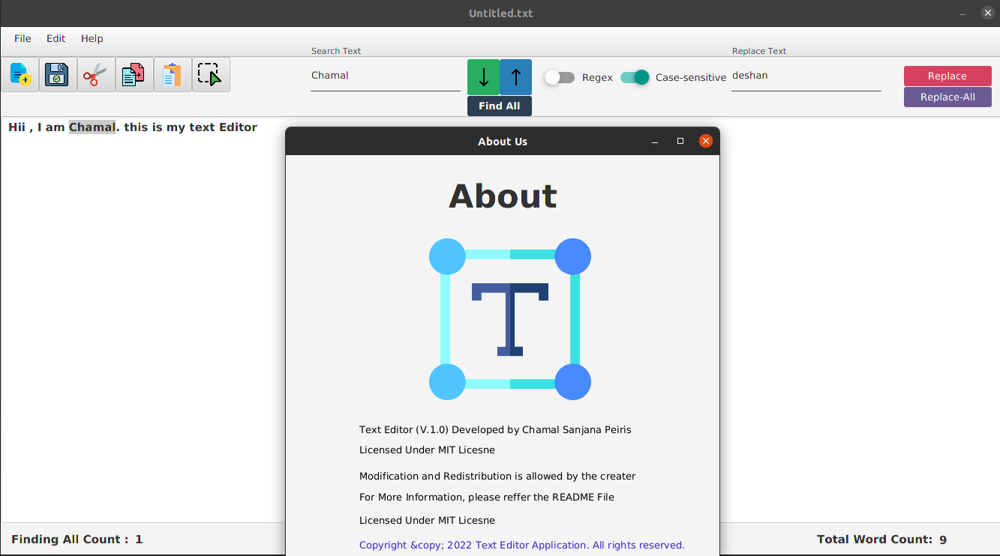

#Simple Text Edior Application

**This is a JavaFX Application where you can perform all the necessary actions such as find, replace, open ,Copy etc. just as any other text editor. In addition, Searching text function is supported with both Regex and case sensitive formats.**

### How to use this repo?

1. Clone the repository first  'git clone'

``https://github.com/chamalpeiris/Simple-Text-Editor.git``

2. Once cloned, open the repository from any prefered IDE

3. Build and Run!

### Prerequisites
1.Use JDK 1.8
2.jfoeinix-8.0.8 library will be needed to enable certain UI components
## User Interface

## Usage

* This editor can be used to search, find replace texts in both case-sensitive and RegEx formats.
* It can also read and write files.
* After editing, the user can print it.

### License

Version 1.0 , 09 January 2022

Copyright &copy; 2022 Text Editor Application. All rights reserved.

Licensed under the [MIT](LICENSE) license

## Acknowledgements

* [Choose an Open Source License](https://choosealicense.com)
